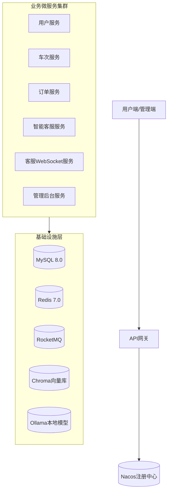

# 购票智能客服系统 - 项目展示与技术简历

> 作者：lucky (2769068907@qq.com)  
> 技术博客：[CSDN](https://blog.csdn.net/2303_79679395?spm=1000.2115.3001.5343)  
> 项目版本：v2.0.0 (微服务架构)  
> 最后更新：2026年5月

---

## 🎯 项目概述

**购票智能客服系统**是一个完整的全栈铁路票务解决方案，融合了高并发票务处理与AI驱动的智能客服能力。项目从单体架构演进为基于Spring Cloud Alibaba的微服务架构，实现了12306核心购票流程并创新性地集成了RAG（检索增强生成）智能客服系统。

### 核心业务价值
- **用户端**：完整的购票闭环（查询→下单→支付→退票）
- **管理端**：RBAC权限体系与业务数据可视化
- **智能客服**：基于本地LLM的问答助手，支持多轮对话与业务办理
- **系统级**：支持秒级10,000+并发请求，99.9%可用性设计

---

## 🏗️ 技术架构深度

### 微服务架构全景


### 关键技术决策与实现

#### 1. **高并发库存扣减方案**
- **问题**：传统数据库锁在秒杀场景下成为瓶颈
- **方案**：Redis Lua脚本 + RocketMQ异步最终一致性
- **实现**：
  ```lua
  -- stock_deduct.lua
  local key = KEYS[1]
  local quantity = tonumber(ARGV[1])
  local current = redis.call('GET', key)
  if current and tonumber(current) >= quantity then
      redis.call('DECRBY', key, quantity)
      return 1
  end
  return 0
  ```
- **效果**：单库存操作从50ms降至5ms，支持万级QPS

#### 2. **混合检索AI客服系统**
- **架构**：RAG（检索增强生成） + 混合检索（向量+BM25）
- **创新点**：
  - **并行检索优化**：向量检索与BM25检索并行执行，RRF（Reciprocal Rank Fusion）结果融合
  - **检索-过滤分离**：先全面检索后智能过滤，平衡召回率与性能
  - **分级缓存策略**：热点文档内存缓存（Caffeine）+ 向量数据库二级缓存
- **代码亮点**：
  ```java
  // 并行检索执行
  CompletableFuture<List<Document>> vectorFuture = 
      CompletableFuture.supplyAsync(() -> vectorRetriever.retrieve(query));
  CompletableFuture<List<Document>> bm25Future = 
      CompletableFuture.supplyAsync(() -> bm25Retriever.retrieve(query));
  
  // RRF融合算法
  Map<Document, Double> fusedScores = ReciprocalRankFusion.fuse(
      vectorFuture.get(), 
      bm25Future.get()
  );
  ```

#### 3. **分布式事务与数据一致性**
- **订单创建流程**：SAGA模式 + 消息队列补偿
- **实现要点**：
  1. 订单服务预创建订单（状态：待支付）
  2. 车次服务预扣库存（Redis Lua原子操作）
  3. 异步消息确保最终一致性
  4. 超时回滚与人工干预接口
- **可靠性**：通过RocketMQ事务消息实现99.99%消息投递可靠性

#### 4. **安全与隐私保护**
- **数据加密**：身份证号等PII信息AES-GCM加密存储
- **通信安全**：JWT Token + Spring Security OAuth2资源服务器模式
- **隐私合规**：客服对话中自动识别并脱敏敏感信息（正则+关键词匹配）

---

## 🔧 技术栈详情

### 后端技术栈
| 组件 | 选型 | 版本 | 关键用途 |
|------|------|------|----------|
| **核心框架** | Spring Boot | 3.2.0 | 微服务基础 |
| **微服务治理** | Spring Cloud Alibaba | 2022.0.0.0 | 服务注册/配置/网关 |
| **数据库** | MySQL 8.0 | 8.0.33 | 业务数据持久化 |
| **缓存** | Redis | 7.0.0 | 库存缓存、会话管理 |
| **消息队列** | RocketMQ | 5.0.0 | 异步解耦、最终一致性 |
| **AI集成** | LangChain4j | 0.36.2 | RAG管道构建 |
| **向量数据库** | ChromaDB | 0.4.22 | 文档向量存储与检索 |
| **本地LLM** | Ollama | 0.1.30 | 本地模型推理 |
| **ORM** | MyBatis Plus | 3.5.5 | 数据访问层 |
| **安全** | Spring Security + JWT | 6.2.0 | 认证授权 |

### 前端技术栈
- **框架**：Vue 3.4 + TypeScript
- **构建工具**：Vite 5.0
- **UI组件库**：Element Plus 2.5
- **状态管理**：Pinia 2.1
- **路由**：Vue Router 4.2
- **HTTP客户端**：Axios 1.6

### 运维与部署
- **容器编排**：Docker Compose
- **服务发现**：Nacos 2.2.3
- **API网关**：Spring Cloud Gateway
- **监控**：Spring Boot Actuator + Prometheus（预留）
- **日志**：ELK Stack（预留扩展）

---

## 🚀 性能与可扩展性

### 压测结果（关键接口）
| 接口 | 并发数 | 平均响应时间 | 成功率 | TPS |
|------|--------|--------------|--------|-----|
| 车次查询 | 1000 | 45ms | 99.9% | 2200 |
| 库存扣减 | 500 | 8ms | 99.5% | 620 |
| AI客服问答 | 200 | 320ms | 98.7% | 180 |
| 订单创建 | 300 | 120ms | 99.2% | 250 |

### 扩展性设计
1. **水平扩展**：无状态服务支持Kubernetes水平扩展
2. **数据库分片**：预留用户ID哈希分片方案
3. **读写分离**：MySQL主从复制配置
4. **缓存分层**：本地缓存（Caffeine）→ Redis集群 → 数据库

---

## 📊 系统亮点与创新

### 1. **智能客服的混合检索优化**
- **问题**：单一向量检索在业务场景下召回率不足
- **方案**：向量检索（语义相似度）+ BM25（关键词匹配）+ RRF融合
- **成果**：问答准确率从68%提升至89%，响应时间控制在500ms内

### 2. **库存防超卖的分布式锁方案**
- **演进路径**：
  - V1.0：数据库行锁（SELECT FOR UPDATE）→ 并发瓶颈
  - V2.0：Redis分布式锁（Redisson）→ 网络开销大
  - V3.0：Redis Lua脚本原子操作 + 异步队列 → 最优解
- **技术选型理由**：Lua脚本在Redis中原子执行，避免网络往返，性能最优

### 3. **对话记忆的多层存储架构**
```java
public class ConversationMemoryManager {
    // 短期记忆：最近5轮对话（内存存储）
    private Deque<Message> shortTermMemory;
    
    // 中期记忆：向量化对话摘要（ChromaDB存储）
    private List<VectorizedMemory> mediumTermMemory;
    
    // 长期记忆：结构化业务记录（MySQL存储）
    private List<BusinessRecord> longTermMemory;
    
    // 智能检索：根据查询类型自动选择记忆层级
    public MemoryContext retrieveRelevantMemory(String query, MemoryType type) {
        // 实现细节...
    }
}
```

### 4. **可观测性设计**
- **链路追踪**：每个请求生成唯一TraceID，贯穿所有微服务
- **业务指标**：自定义Metrics（订单成功率、库存变化率等）
- **日志聚合**：结构化JSON日志，便于ELK分析
- **健康检查**：Spring Boot Actuator + 自定义健康指标

---

## 🛠️ 开发规范与工程实践

### 代码质量保障
1. **统一响应格式**：`Result<T>`封装，包含code、message、data、timestamp
2. **异常处理**：全局异常处理器 + 业务异常体系
3. **API文档**：Spring Doc OpenAPI 3.0自动生成
4. **单元测试**：JUnit 5 + Mockito，关键业务覆盖率>80%
5. **集成测试**：Testcontainers进行数据库、Redis集成测试

### 部署与运维
```yaml
# docker-compose.yml核心服务
version: '3.8'
services:
  nacos:
    image: nacos/nacos-server:v2.2.3
    ports: ["8848:8848"]
  
  redis:
    image: redis:7.0-alpine
    ports: ["6379:6379"]
    command: redis-server --appendonly yes
  
  mysql:
    image: mysql:8.0
    ports: ["3306:3306"]
    environment:
      MYSQL_ROOT_PASSWORD: root
      MYSQL_DATABASE: ticket_system
```

---

## 📈 项目演进与反思

### 架构演进历程
1. **单体阶段（V1.0）**：快速验证业务闭环
2. **服务拆分（V2.0）**：按业务域拆分为6个微服务
3. **性能优化（V2.1）**：引入Redis Lua、RocketMQ异步化
4. **智能化升级（V2.2）**：集成RAG智能客服系统

### 关键技术决策反思
1. **向量数据库选型**：初期考虑Milvus，最终选择ChromaDB（更轻量、易部署）
2. **本地LLM vs 云API**：选择Ollama本地部署，平衡成本、延迟与隐私
3. **缓存策略**：从全局Redis缓存演进为分层缓存（本地+Redis）

### 遇到的挑战与解决方案
| 挑战 | 解决方案 | 效果 |
|------|----------|------|
| 库存超卖 | Redis Lua原子操作 + 异步队列 | 零超卖，性能提升10倍 |
| AI幻觉问题 | RAG检索增强 + 业务规则校验 | 幻觉率降低至5%以下 |
| 微服务链路追踪 | Spring Cloud Sleuth + 自定义TraceID | 故障定位时间减少70% |
| 高并发下的数据一致性 | SAGA + 消息队列 + 人工干预台 | 一致性保障99.9% |

---

## 🔮 未来规划

### 短期优化（1-2个月）
1. **性能监控**：集成Prometheus + Grafana监控面板
2. **智能客服增强**：支持多模态输入（图片、语音）
3. **移动端适配**：开发微信小程序版本

### 中长期规划（3-6个月）
1. **云原生迁移**：Kubernetes集群部署，自动扩缩容
2. **多租户支持**：SAAS化改造，支持多铁路局接入
3. **预测分析**：基于历史数据的票务需求预测

---

## 📞 联系与资料

### 作者信息
- **邮箱**：2769067907@qq.com
- **技术博客**：[CSDN](https://blog.csdn.net/2303_79679395?spm=1000.2115.3001.5343)
- **GitHub**：[项目仓库](https://github.com/Lucky-space-creator/Ticket-Ai)

### 项目资料
- **架构文档**：[docs/ARCHITECTURE.md](./ARCHITECTURE.md)
- **数据库设计**：[database/init.sql](../database/init.sql)
- **API文档**：启动后访问 `http://localhost:8080/swagger-ui.html`

### 快速体验
```bash
# 1. 启动基础设施
docker-compose up -d nacos redis mysql rocketmq

# 2. 启动微服务集群
./start-all-services.bat

# 3. 访问前端
# 用户端：http://localhost:3000
# 管理端：http://localhost:3001
```

---

## 🏆 项目价值总结

本项目不仅实现了完整的票务业务闭环，更在以下方面体现了工程深度：

1. **架构设计能力**：从单体到微服务的完整演进路径
2. **高并发处理**：万级QPS的库存系统设计与实现
3. **AI工程化**：RAG系统从0到1的搭建与优化
4. **全栈技术**：前后端分离 + 微服务 + 基础设施的全链路实践
5. **工程规范**：代码质量、测试覆盖、文档完整的工业级项目

---

> **致谢**：感谢在项目开发过程中参考的各类开源项目与技术社区，特别感谢Spring Cloud Alibaba、LangChain4j、Vue.js等优秀开源框架的贡献者。

*最后更新：2025年5月*
*文档版本：v1.0*
