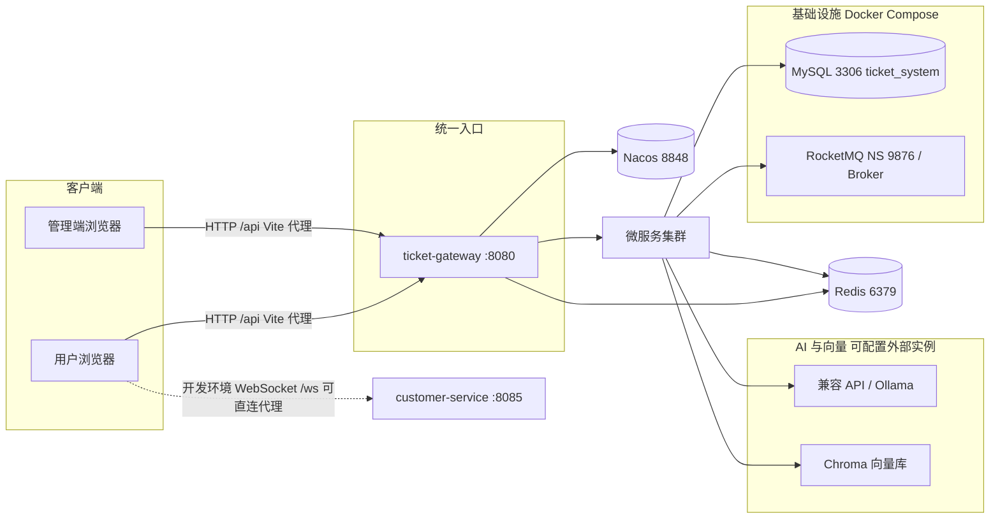
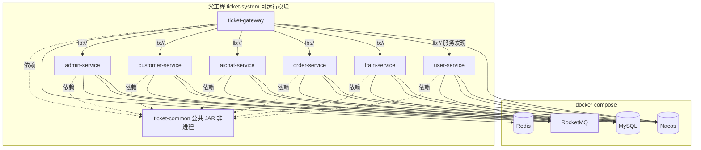
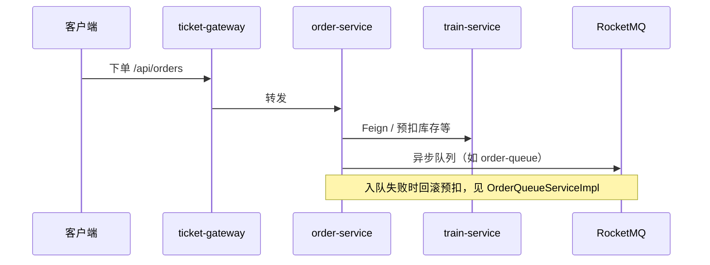

# 购票智能客服系统 — 架构说明与架构图

> 本文描述 **Maven 父工程 `ticket-system`** 下微服务运行平面的架构（与 `docs/microservices/README.md` 一致）。  
> `backend/` 为单体对照源码，**不参与** Nacos 注册与网关路由，下文不将其纳入运行拓扑。

**版本**: 与父工程 `ticket-parent` `2.0.0` 对齐  
**更新时间**: 依据仓库当前配置整理

---

## 1. 系统上下文（企业与外部依赖）

说明：

- **前端**：`frontend` 开发服默认 `3000`，`/api` 代理至网关 `8080`；`/ws` 在 `vite.config.js` 中指向 `customer-service` `8085`（与经网关的 `/ws/**` 并存，按环境选择）。  
- **管理端**：`admin` 开发服默认 `3001`，代理规则同上。  
- **aichat-service** 通过配置对接 **HTTP API（如 OpenAI 兼容）或 Ollama**、**Chroma** 等，地址以各服务 `application.yml` 为准。

---

## 2. 运行平面：网关、服务与基础设施

---

## 3. 网关路由一览（与代码一致）

`ticket-gateway` 基于 **Spring Cloud Gateway**，通过 **Nacos 服务发现** `lb://{service-id}` 转发；部分路由挂载 **Redis RequestRateLimiter**。

| 路由用途 | Path 前缀（节选） | 目标服务 |
|----------|-------------------|----------|
| 登录/注册（白名单相关） | `/api/auth/login`, `/api/auth/register` | user-service |
| 用户与乘车人 | `/api/user/**`, `/api/passengers/**` | user-service（限流） |
| 车次与余票 | `/api/trains/**`, `/api/ticket-stocks/**` | train-service |
| 排队只读 | `/api/orders/queue/**` | order-service |
| 订单 | `/api/orders/**` | order-service（限流） |
| 智能客服与知识库 | `/api/chat/**`, `/api/knowledge/**` | aichat-service |
| 客服 REST | `/api/customer-service/**` | customer-service |
| 客服 WebSocket | `/ws/**` | customer-service |
| 管理端登录 | `/api/admin/auth/login` | admin-service |
| 管理端 | `/api/admin/**` | admin-service |

JWT 密钥需与 **user-service / order-service / customer-service / aichat-service** 等签发与校验侧保持一致（参见网关 `application.yml` 注释）。

---

## 4. 微服务默认端口（本地 application.yml）

| 服务 | spring.application.name | 默认端口 |
|------|-------------------------|----------|
| ticket-gateway | ticket-gateway | 8080 |
| admin-service | admin-service | 8081 |
| train-service | train-service | 8082 |
| order-service | order-service | 8083 |
| aichat-service | aichat-service | 8084 |
| customer-service | customer-service | 8085 |
| user-service | user-service | 8089 |

生产或 Nacos 配置可覆盖端口与数据源；上表便于本地联调对照。

---

## 5. 订单链与消息（逻辑视图）

与 `docs/microservices/ORDER-AND-MQ.md` 一致，核心关系可概括为：

跨服务补偿、Topic 归属与可靠消息演进以 `ORDER-AND-MQ.md` 为准。

---

## 6. AI 客服子域（逻辑）

- **aichat-service**：对话、知识库 API；**LangChain4j**；文档解析与入库；RAG 检索（Chroma / 可降级）；FAQ 字面匹配短路。  
- 细节与护栏策略见 [`AI-GUARDRAILS.md`](./microservices/AI-GUARDRAILS.md) 及 `aichat-service` 配置。

---

## 7. 配置与发现

- 各服务 `bootstrap.yml` 默认指向 **Nacos `localhost:8848`**。  
- 网关及部分服务从 Nacos 拉取共享配置，例如：`sharding-redis-config.yaml`、`sharding-gateway-config.yaml`、`sharding-database-config.yaml` 等（以 `bootstrap.yml` 中 `shared-configs` 为准）。

---

## 8. 文档与代码索引

| 说明 | 路径 |
|------|------|
| 微服务总览 | [microservices/README.md](./microservices/README.md) |
| 本地依赖与启动顺序 | [microservices/LOCAL-ENVIRONMENT.md](./microservices/LOCAL-ENVIRONMENT.md) |
| 网关安全与限流 | [microservices/GATEWAY-SECURITY.md](./microservices/GATEWAY-SECURITY.md) |
| 订单与 MQ | [microservices/ORDER-AND-MQ.md](./microservices/ORDER-AND-MQ.md) |
| 网关路由源码 | `ticket-gateway/src/main/resources/application.yml` |
| Compose 基础设施 | 项目根目录 `docker-compose.yml` |

---

*若 Mermaid 图在本地预览中无法渲染，可使用支持 Mermaid 的 Markdown 预览器，或复制图表代码至 [mermaid.live](https://mermaid.live) 导出 PNG/SVG。*
